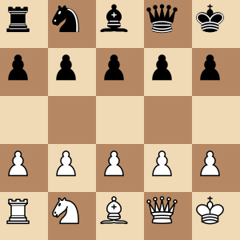

# Deep Learning Applied to Minichess

A study on applying Deep Learning to minichess (Gardner variant). Experimenting with first supervised learning followed by self-play.



---


## TIL
### 250426
- export environment variables in fish: `set --export PYTHONPATH /home/usbt0p/TFG/`. To make this permanent, put `set -xg PYTHONPATH /path/to/test/folder $PYTHONPATH` at the end of `~/.config/fish/config.fish`
- to make vscode auto export vars in `.env` files, create an env file add 
    ```
    {
    "python.envFile": "${workspaceFolder}/.env"
    }
    ```
    to the `.vscode/settings.json` file.

### 290426
Un heredoc es una forma de pasarle datos a un programa como si se le pasaras por entrada estándar.
En Bash, cuando pones comillas al identificador del heredoc (<< 'EOF'), le estás diciendo al shell que no expanda las variables que hay dentro. Así que para strings literales es mejor usar comillas, y para cosas como esta no:

```bash
input_file=$1
output_file=$2

./variant-nnue-tools/src/stockfish << EOF
setoption name UCI_Variant value gardner
gather_statistics all input_file $input_file output_file_name $output_file
quit
EOF
```

## 020526

descargo una librería. no tengo autocompletado por lo tanto no tengo ni idea ni de las funciones que hay disponibles en la librería. mirando en .venv/.../site-packages/ parece que la librería es un binario de cpython . cómo puedo hacer para que tenga autocompletado?

Para solucionar este problema con las librerías compiladas en C (.so), he utilizado una herramienta estándar llamada stubgen (del paquete mypy).Esta herramienta inspecciona dinámicamente el binario de CPython importado y genera un archivo de "stubs" de tipado con extensión .pyi.

```
uv add mypy
.venv/bin/stubgen -m pyffish -o <your-output-dir>
```

Pero a veces visual studio y sus forks siguen dando por culo:

```
Cannot find module `...`
  Looked in these locations (from default config for project root marked by `/home/usbt0p/project/pyproject.toml`):
  Import root (inferred from project layout): "/home/usbt0p/project/src"
  Site package path queried from interpreter: ["/home/usbt0p/project/.venv/lib/python3.14/site-packages"] 
```

Esto es una cuestión de rutas. asegúrate de que el entorno virtual esté activado (ej: `source .venv/bin/activate`) y que la ruta sea la correcta.


---


## Data Pipeline: Cómo generar, procesar y unir los datasets

Para conseguir el gran dataset final unificado (el fichero *merged* sin duplicados), el flujo de trabajo paso a paso es el siguiente, combinando las utilidades de Fairy-Stockfish con los scripts custom creados en el proyecto:

### 1. Generación de partidas (`.bin`)
Inicialmente, los datos se generan usando el script `src/dataUtils/run_gen.sh`, el cual es un wrapper automatizado sobre el comando `generate_training_data` de Stockfish. 
Este script facilita la generación al permitir configurar por parámetros la variante, profundidad de búsqueda, hilos y RAM, generando automáticamente los archivos `.bin` (compuestos por estructuras `PackedSfenValue` de 72 bytes) y sus respectivos logs (`.log`).

Ejemplos de uso:
```bash
# Generar datos a profundidad 2 usando 16 hilos y toda la memoria RAM disponible (auto)
./src/dataUtils/run_gen.sh -v gardner -d 2 -t 16 -m auto

# Generar datos a profundidad 3 y 4
./src/dataUtils/run_gen.sh -v gardner -d 3 -t 16 -m auto
./src/dataUtils/run_gen.sh -v gardner -d 4 -t 16 -m auto
```
*Tip: Se recomienda generar distintos conjuntos a diferentes profundidades (d4, d3, d2) para maximizar la cantidad de datos sin demorar eternamente el tiempo de cómputo.*

### 2. Fusión y Deduplicación Binaria (`merge_datasets_bin.py`)
Intentar unir los datasets en su versión texto sería inviable por el uso inmenso de memoria RAM. Por ello, procesamos el formato binario:
```bash
python3 src/dataUtils/merge_datasets_bin.py
```
- Lee cada `.bin` en fragmentos de 72 bytes.
- Utiliza los primeros 64 bytes (`PackedSfen`, que codifica exactamente la posición del tablero) como un *hash* en un `set()` de Python para detectar duplicados.
- **Importante**: Se le pasan los archivos de mayor profundidad primero (d4 > d3 > d2). Así, la primera vez que se ve una posición se guarda su evaluación de mejor calidad y si vuelve a aparecer en profundidades menores, se ignora por considerarse un "duplicado inferior".
- Devuelve un único archivo binario gigante y deduplicado (ej. `data/merged/merged_gardner.bin`).

### 3. Extracción de Estadísticas (`stats.sh` y `plot_datagen_stats.py`)
El generador de estadísticas de Stockfish (`gather_statistics`) **solo lee archivos `.bin`**, de ahí la importancia de haber hecho el "merge" en formato binario.
```bash
# Saca los recuentos de piezas, mate, etc.
./src/dataUtils/stats.sh data/merged/merged_gardner.bin data/merged/stats.txt

# Genera los histogramas 3D y gráficas categóricas
python3 src/dataUtils/plot_datagen_stats.py data/merged/stats.txt
```

### 4. Conversión a Texto para PyTorch (`convert.sh`)
Puesto que nuestro DataLoader personalizado (`MinichessTextDataset`) parsea texto para reconstruir su propia matriz ultra-compacta en Numpy, usamos la herramienta de Stockfish `convert_plain` envuelta en nuestro script de Bash para evitar problemas del *heredoc*:
```bash
./src/dataUtils/convert.sh data/merged/merged_gardner.bin data/merged/merged_gardner.txt
```
Ese archivo final `.txt` es el que usará la red neuronal y cacheará en formato `.pt` automáticamente.

## Generar los Stubs de pyffish
Si tu editor tiene problemas con los imports o el autocompletado de pyffish:
```bash
uv add mypy
.venv/bin/stubgen -m pyffish -o <your-output-dir>
```