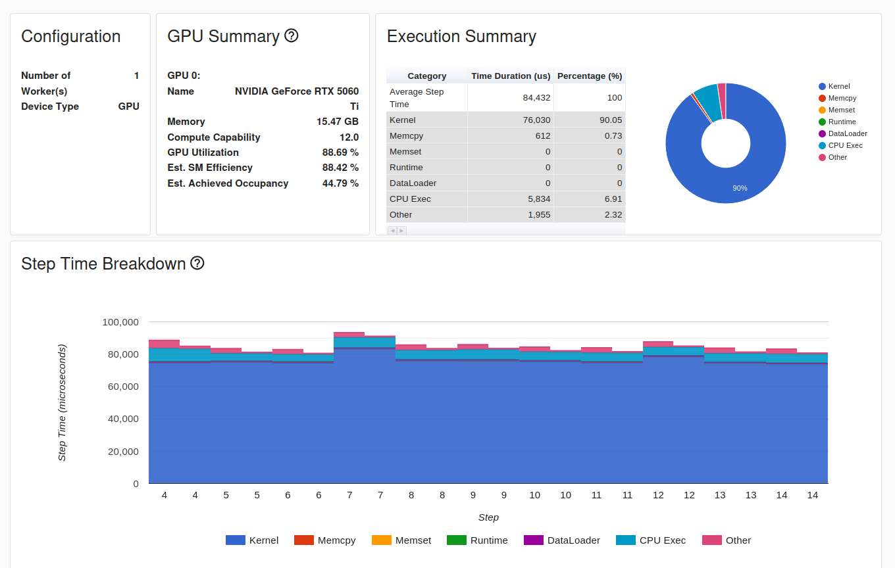

# Deep Learning Applied to Minichess

Trabajo de Fin de Grado sobre aplicación y estudio del Aprendizaje por Refuerzo (RL) sobre una variante de ajedrez simplificada, el ajedrez 5 × 5 (ajedrez de Gardner o Minichess). El objetivo central es validar el uso de arquitecturas Transformer modernas en tareas de RL, estudiando el efecto de las representaciones del tablero y comprobando si el preentrenamiento supervisado mejora la convergencia del agente.

Esto imita en cierto modo el proceso de entrenamiento de un LLM, donde se preentrena al modelo inicialmente con una tarea (auto)supervisada (predicción del siguiente token/jugada) para luego afinarlo con RL mediante PPO (Policy Gradient). Encontrarás información mas detallada en [la memoria del proyecto](doc/docs.pdf).

> *Objetivo actual:* Desarrollar scripts para self-play, y demostrar si el preentrenamiento con supervisión es beneficioso para el aprendizaje por refuerzo (hipótesis 3).


> [!CAUTION]
> El proyecto está en desarrollo! Todo está sujeto a cambios. Los resultados de los experimentos se van publicando en la documentación. Puede haber ramas adelantadas con respecto a esta versión.

## Arquitectura del transformer encoder
El modelo utilizado es un transformer encoder con cabezas específicas de política y valor, adaptadas al ajedrez. Si te interesa la arquitectura, tienes el código en [src/models/transformerEncoder.py](src/models/transformerEncoder.py).

Este es un diagrama general (sin codificación posicional 2D, ni cabezas auxiliares):

```mermaid
flowchart TD
    IN(["Chess State Vector (dim=27)"])
    
    %% Input Splitting & Shifting (Simple Representation)
    SPLIT["Split Input"]
    IN --> SPLIT
    
    BOARD_FLAT["board_flat (dim=25)"]
    REP["repetitions (dim=1)"]
    HALFMOVE["halfmove_50 (dim=1)"]
    
    SPLIT --> BOARD_FLAT
    SPLIT --> REP
    SPLIT --> HALFMOVE
    
    CLAMP_REP["Clamp to [0, 2] & Shift +13"]
    CLAMP_HM["Clamp to [0, 51] & Shift +16"]
    
    REP --> CLAMP_REP
    HALFMOVE --> CLAMP_HM
    
    CAT_TOKENS["Concat Tokens (dim=27)"]
    BOARD_FLAT --> CAT_TOKENS
    CLAMP_REP --> CAT_TOKENS
    CLAMP_HM --> CAT_TOKENS
    
    W_EMBED["w_embed: ChessEmbeddingSimple<br/>(vocab=68 → embed_dim)"]
    CAT_TOKENS --> W_EMBED
    
    %% Prepending CLS token
    CLS_PARAM[["cls_token Parameter<br/>(1, 1, embed_dim)"]]
    EXPAND_CLS["Expand CLS to Batch Size<br/>(B, 1, embed_dim)"]
    CLS_PARAM --> EXPAND_CLS
    
    CAT_CLS["Concat CLS + Board Embeddings<br/>(B, 28, embed_dim)"]
    EXPAND_CLS --> CAT_CLS
    W_EMBED --> CAT_CLS
    
    %% Positional Embeddings
    W_POS_EMBED["w_pos_embed: Embedding<br/>(28 → embed_dim)"]
    ADD_POS["Add Positional Embeddings"]
    CAT_CLS --> ADD_POS
    W_POS_EMBED --> ADD_POS
    
    EMBED_DROPOUT["embed_dropout: Dropout (p=0.1)"]
    ADD_POS --> EMBED_DROPOUT
    
    %% Transformer Block 0 (Detailed)
    subgraph TB0 ["Transformer Block 0 (Detailed)"]
        RES1["Save Residual 1"]
        NORM1["norm1: RMSNorm"]
        MHA["mha: MultiheadAttention (H heads)"]
        ADD1["Add (Residual 1 + Attention Output)"]
        
        RES2["Save Residual 2"]
        NORM2["norm2: RMSNorm"]
        
        subgraph MLP0 ["mlp: MLP"]
            MLP_LIN1["Linear (embed_dim → mlp_expand_factor * embed_dim)"]
            MLP_GELU["GELU"]
            MLP_LIN2["Linear (mlp_expand_factor * embed_dim → embed_dim)"]
            MLP_DROP["Dropout (mlp_dropout)"]
            
            MLP_LIN1 --> MLP_GELU
            MLP_GELU --> MLP_LIN2
            MLP_LIN2 --> MLP_DROP
        end
        
        ADD2["Add (Residual 2 + MLP Output)"]
        
        RES1 --> NORM1
        NORM1 --> MHA
        RES1 --> ADD1
        MHA --> ADD1
        
        ADD1 --> RES2
        RES2 --> NORM2
        NORM2 --> MLP_LIN1
        RES2 --> ADD2
        MLP_DROP --> ADD2
    end
    
    EMBED_DROPOUT --> RES1
    
    %% Backbone: Remaining Blocks (N-1 Blocks)
    subgraph Backbone ["Backbone (Remaining Blocks)"]
        TB_1["Transformer Block 1"]
        TB_DOTS["..."]
        TB_NM1["Transformer Block N-1"]
        
        TB_1 --> TB_DOTS
        TB_DOTS --> TB_NM1
    end
    
    ADD2 --> TB_1
    
    FINAL_NORM["final_norm: RMSNorm"]
    TB_NM1 --> FINAL_NORM
    
    %% Slicing Output
    SLICE_CLS["Slicing: cls_output = x[:, 0, :]<br/>(B, embed_dim)"]
    SLICE_BOARD["Slicing: board_tokens = x[:, 1:26, :]<br/>(B, 25, embed_dim)"]
    
    FINAL_NORM --> SLICE_CLS
    FINAL_NORM --> SLICE_BOARD
    
    %% Matrix Policy Head Details
    subgraph PolicyHead ["policy: MatrixPolicyHead"]
        PROJ_FROM["proj_from: Sequential Linear<br/>(embed_dim → policy_head_hidden_dim * 2 → policy_head_hidden_dim)"]
        PROJ_TO["proj_to: Sequential Linear<br/>(embed_dim → policy_head_hidden_dim * 2 → policy_head_hidden_dim)"]
        PROJ_PROMO["proj_promo: Linear<br/>(embed_dim → promotion_size=104)"]
        
        EINSUM["Outer Product (einsum)<br/>(B, 25, 25)"]
        FLATTEN_MASK["Flatten & Apply eye_mask (diagonal removal)<br/>(B, 600)"]
        CAT_POLICY["Concat (base_moves + promo_logits)"]
        
        SLICE_BOARD --> PROJ_FROM
        SLICE_BOARD --> PROJ_TO
        SLICE_CLS --> PROJ_PROMO
        
        PROJ_FROM --> EINSUM
        PROJ_TO --> EINSUM
        EINSUM --> FLATTEN_MASK
        
        FLATTEN_MASK --> CAT_POLICY
        PROJ_PROMO --> CAT_POLICY
    end
    
    %% Value Head Details
    subgraph ValueHead ["value: ValueHead"]
        VAL_LINEAR1["Linear (embed_dim → mlp_expand_factor * embed_dim)"]
        VAL_GELU["GELU"]
        VAL_DROPOUT["Dropout (p=0.1)"]
        VAL_LINEAR2["Linear (mlp_expand_factor * embed_dim → 1)"]
        VAL_TANH["Tanh"]
        
        SLICE_CLS --> VAL_LINEAR1
        VAL_LINEAR1 --> VAL_GELU
        VAL_GELU --> VAL_DROPOUT
        VAL_DROPOUT --> VAL_LINEAR2
        VAL_LINEAR2 --> VAL_TANH
    end
    
    %% Outputs
    OUT_POLICY(["policy_logits<br/>(B, 704)"])
    OUT_VALUE(["value_pred<br/>(B, 1)"])
    
    CAT_POLICY --> OUT_POLICY
    VAL_TANH --> OUT_VALUE
```




---

## Data Pipeline: Cómo generar, procesar y unir los datasets

Para conseguir el dataset final, el flujo de trabajo paso a paso es el siguiente, combinando las utilidades de Fairy-Stockfish con scripts propios:

### 1. Generación de partidas (`.bin`)
Inicialmente, los datos se generan usando el script `src/dataUtils/run_gen.sh`, el cual es un wrapper automatizado sobre el comando `generate_training_data` de Stockfish. 
Este script facilita la generación al permitir configurar por parámetros la variante, profundidad de búsqueda, hilos y RAM, generando automáticamente los archivos `.bin` (compuestos por estructuras `PackedSfenValue` de 72 bytes) y sus respectivos logs (`.log`).

Ejemplos de uso:
```bash
# Generar datos a profundidad 2 usando 16 hilos y toda la memoria RAM disponible (auto)
./src/dataUtils/run_gen.sh -v gardner -d 2 -t 16 -m auto

# Generar datos a profundidad 3 y 4
./src/dataUtils/run_gen.sh -v gardner -d 3 -t 16 -m auto
./src/dataUtils/run_gen.sh -v gardner -d 4 -t 16 -m auto
```
*Puedes generar distintos conjuntos a diferentes profundidades (d4, d3, d2) para maximizar la cantidad de datos sin demorar eternamente el tiempo de cómputo.*

### 2. Fusión y Deduplicación Binaria (`merge_datasets_bin.py`)

> [!NOTE]
> No es necesario unir los archivos. Aquí lo ilustro pero los experimentos se conducen con una sola profundidad. Si no lo haces, puedes saltarte este paso.

Intentar unir los datasets en su versión texto sería inviable por el uso inmenso de memoria RAM. Por ello, procesamos el formato binario:
```bash
python3 src/dataUtils/merge_datasets_bin.py
```
- Lee cada `.bin` en fragmentos de 72 bytes.
- Utiliza los primeros 64 bytes (`PackedSfen`, que codifica exactamente la posición del tablero) como un *hash* en un `set()` de Python para detectar duplicados.
- **Importante**: Se le pasan los archivos de mayor profundidad primero (d4 > d3 > d2). Así, la primera vez que se ve una posición se guarda su evaluación de mejor calidad y si vuelve a aparecer en profundidades menores, se ignora por considerarse un "duplicado inferior".
- Devuelve un único archivo binario gigante y deduplicado (ej. `data/merged/merged_gardner.bin`).


### 3. Extracción de Estadísticas (`stats.sh` y `plot_datagen_stats.py`)
El generador de estadísticas de Stockfish (`gather_statistics`) **solo lee archivos `.bin`**, de ahí el "merge" en formato binario.

Se proporcionan 2 scripts para análisis de datos: `stats.sh` y `plot_datagen_stats.py`. El primero genera un fichero de texto con estadísticas del dataset (usando fair-stockfish por detrás) y el segundo genera histogramas, gráficas de distribución de las estadísticas e imágenes de posiciones comunes. Ambos son opcionales pero útiles para entender los datos con los que trabajamos.

```bash
# Saca los recuentos de piezas, mate, etc.
./src/dataUtils/stats.sh data/merged/merged_gardner.bin data/merged/stats.txt

# Genera los histogramas 3D y gráficas categóricas
python3 src/dataUtils/plot_datagen_stats.py data/merged/stats.txt
```

### 4. Conversión a Texto para PyTorch (`convert.sh`)
Puesto que nuestro DataLoader personalizado (`MinichessTextDataset`) parsea texto para reconstruir su propia matriz ultra-compacta en Numpy, usamos la herramienta de Stockfish `convert_plain` envuelta en nuestro script de Bash para evitar problemas del *heredoc*:
```bash
./src/dataUtils/convert.sh data/merged/merged_gardner.bin data/merged/merged_gardner.txt
```
Ese archivo final `.txt` es el que usará la red neuronal y cacheará en formato `.pt` automáticamente.

### 5. Particularidades de los datos
- La generacion de los datos filtra automaticamente los movimientos ilegales, capturas, promociones y otras situaciones tácticas donde la evaluación fluctúa bruscamente.
- La generación omite el tipo de pieza a la que se promociona. Para gestionar esto, los data parsers asumen que un peon en la última fila se promociona a reina siempre.

### 6. Data Splitting
Asegúrate de utilizar el script `create_static_splits.py` para division de datos en train / test. Este se encarga de generar un fichero de holdout y asegurarse de que no haya filtrado de datos al evitar seleccionar posiciones de una misma partida para train y test. 

---

## Otras utilidades

### Generar los Stubs de pyffish
Si tu editor tiene problemas con los imports o el autocompletado de pyffish:
```bash
uv add mypy
.venv/bin/stubgen -m pyffish -o <your-output-dir>
```

### Compilar documentación en LaTeX
Dependencias:
```
sudo apt update
sudo apt install texlive texlive-bibtex-extra biber
sudo apt install latexmk texlive-latex-extra
```
Compilación:
```
latexmk -outdir=doc -auxdir=doc/aux -pdf doc/docs.tex
```

O utilizar la extensión de `LaTeX Workshop` en VSCode (menos recomendado, funciona regular). En ese caso, para evitar contaminar el directorio con archivos auxiliares, añadir al `.vscode/settings.json`:
```json
{
    "latex-workshop.latex.auxDir": "${workspaceFolder}/doc/aux",
    "latex-workshop.latex.outDir": "${workspaceFolder}/doc"
}
```

### Ejecutar profilers te PyTorch
Útil para maximizar el aprovechamiento de GPU antes de lanzar runs grandes. Permite optimizar backends de atención, comprobar los kernels en uso con torch.compile(), ver tiempor por kernel, y verificar el uso de tensor cores para las TPUs.
```bash
python3 src/training/train.py <your_data_path> <embed_dim> --profile <run_name> --profile_steps <n_steps> --profile_desc "<description>"
```
Para ver los resultados con la interfaz, es igual que en cualquier otro run de tensorboard:
```bash
tensorboard --logdir=./profiles
```
Deberías ver algo así:



### Ejecutar Optuna Hyperparameter Optimization y visualizar resultados
No tiene argumentos. Especifica los hiperparámetros a optimizar y el número de trials, etc. en el propio script.
Principalmente útil para ajustar learning rate + parámetros de AdamW frente a distintos batch sizes y anchuras / profundidades de modelo. [Maximal Update Parameterization](https://howtoscalenn.github.io/) a veces funciona y se puede asumir escalar LR con batch size de forma proporcional, o de forma inversa en el caso de anchura del modelo. Pero el LR es [complicado](https://wandb.ai/dalle-mini/dalle-mini/reports/DALL-E-Mega-Training-Journal--VmlldzoxODMxMDI2) e importante, si se puede hacer búsqueda en tiempo razonable, mejor.
```bash
python3 src/experiment_scripts/run_optuna_tuning.py
```
Para ver los resultados, puedes usar `optuna-dashboard` (require instalación):
```bash
optuna-dashboard sqlite:///logs/tuning/tuning_dk64_depth8.db
```

