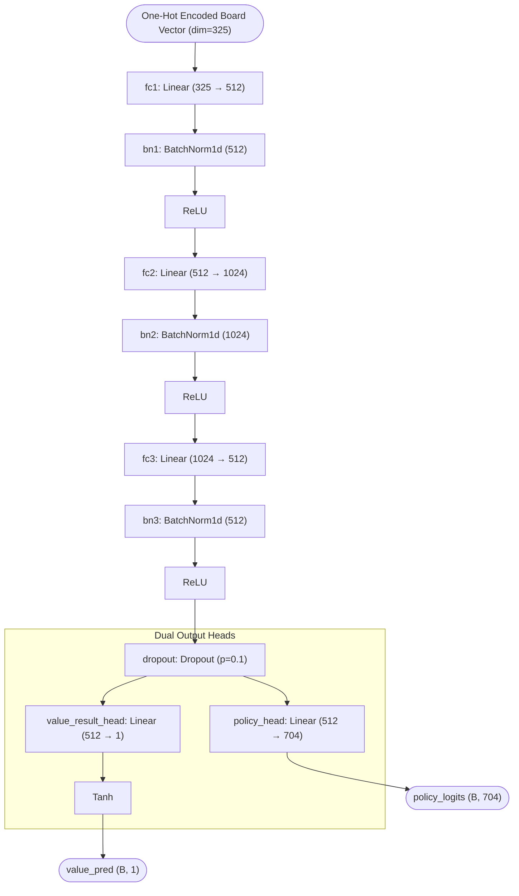
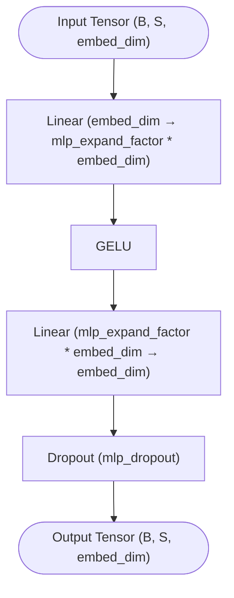
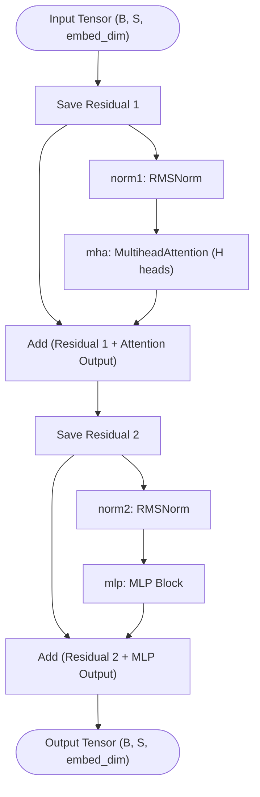
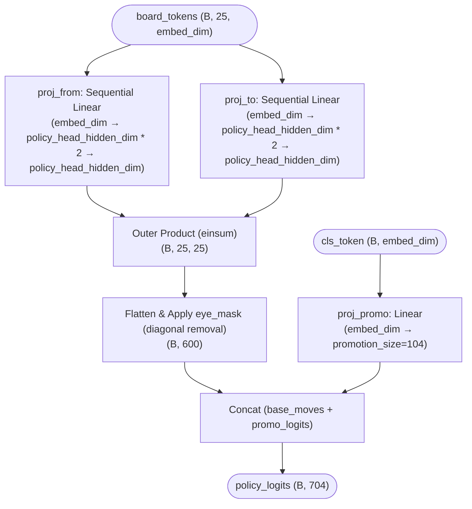
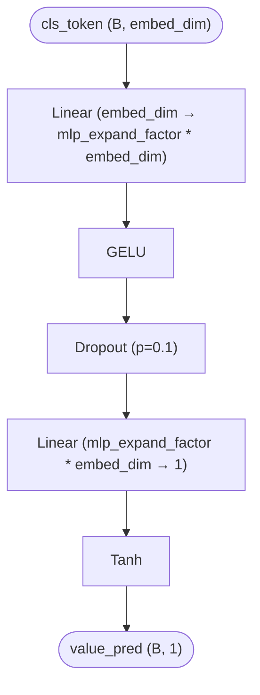

Some diagrams for model architectures.
These architecture diagrams were LLM generated, there might be some inaccuracies!

Diagrams:
1. [MLP Baseline](#mlp-baseline-fnnpromotionmaskingpy)
2. [Transformer Block Feed-Forward Network](#transformer-block-feed-forward-network-mlp)
3. [Transformer Block](#transformer-block-transformerblock)
4. [Policy Head](#policy-head-matrixpolicyhead)
5. [Value Head](#value-head-valuehead)
6. [MiniChess Transformer Encoder Full Architecture](#minichess-transformer-encoder-full-architecture)

---

# MLP Baseline (fnnPromotionMasking.py)

# Transformer Block Feed-Forward Network (MLP)

# Transformer Block (TransformerBlock)

# Policy Head (MatrixPolicyHead)

# Value Head (ValueHead)

# MiniChess Transformer Encoder (Full Architecture)

```mermaid
flowchart TD
    IN(["Chess State Vector (dim=27)"])
    
    %% Input Splitting & Shifting (Simple Representation)
    SPLIT["Split Input"]
    IN --> SPLIT
    
    BOARD_FLAT["board_flat (dim=25)"]
    REP["repetitions (dim=1)"]
    HALFMOVE["halfmove_50 (dim=1)"]
    
    SPLIT --> BOARD_FLAT
    SPLIT --> REP
    SPLIT --> HALFMOVE
    
    CLAMP_REP["Clamp to [0, 2] & Shift +13"]
    CLAMP_HM["Clamp to [0, 51] & Shift +16"]
    
    REP --> CLAMP_REP
    HALFMOVE --> CLAMP_HM
    
    CAT_TOKENS["Concat Tokens (dim=27)"]
    BOARD_FLAT --> CAT_TOKENS
    CLAMP_REP --> CAT_TOKENS
    CLAMP_HM --> CAT_TOKENS
    
    W_EMBED["w_embed: ChessEmbeddingSimple<br/>(vocab=68 → embed_dim)"]
    CAT_TOKENS --> W_EMBED
    
    %% Prepending CLS token
    CLS_PARAM[["cls_token Parameter<br/>(1, 1, embed_dim)"]]
    EXPAND_CLS["Expand CLS to Batch Size<br/>(B, 1, embed_dim)"]
    CLS_PARAM --> EXPAND_CLS
    
    CAT_CLS["Concat CLS + Board Embeddings<br/>(B, 28, embed_dim)"]
    EXPAND_CLS --> CAT_CLS
    W_EMBED --> CAT_CLS
    
    %% Positional Embeddings
    W_POS_EMBED["w_pos_embed: Embedding<br/>(28 → embed_dim)"]
    ADD_POS["Add Positional Embeddings"]
    CAT_CLS --> ADD_POS
    W_POS_EMBED --> ADD_POS
    
    EMBED_DROPOUT["embed_dropout: Dropout (p=0.1)"]
    ADD_POS --> EMBED_DROPOUT
    
    %% Transformer Block 0 (Detailed)
    subgraph TB0 ["Transformer Block 0 (Detailed)"]
        RES1["Save Residual 1"]
        NORM1["norm1: RMSNorm"]
        MHA["mha: MultiheadAttention (H heads)"]
        ADD1["Add (Residual 1 + Attention Output)"]
        
        RES2["Save Residual 2"]
        NORM2["norm2: RMSNorm"]
        
        subgraph MLP0 ["mlp: MLP"]
            MLP_LIN1["Linear (embed_dim → mlp_expand_factor * embed_dim)"]
            MLP_GELU["GELU"]
            MLP_LIN2["Linear (mlp_expand_factor * embed_dim → embed_dim)"]
            MLP_DROP["Dropout (mlp_dropout)"]
            
            MLP_LIN1 --> MLP_GELU
            MLP_GELU --> MLP_LIN2
            MLP_LIN2 --> MLP_DROP
        end
        
        ADD2["Add (Residual 2 + MLP Output)"]
        
        RES1 --> NORM1
        NORM1 --> MHA
        RES1 --> ADD1
        MHA --> ADD1
        
        ADD1 --> RES2
        RES2 --> NORM2
        NORM2 --> MLP_LIN1
        RES2 --> ADD2
        MLP_DROP --> ADD2
    end
    
    EMBED_DROPOUT --> RES1
    
    %% Backbone: Remaining Blocks (N-1 Blocks)
    subgraph Backbone ["Backbone (Remaining Blocks)"]
        TB_1["Transformer Block 1"]
        TB_DOTS["..."]
        TB_NM1["Transformer Block N-1"]
        
        TB_1 --> TB_DOTS
        TB_DOTS --> TB_NM1
    end
    
    ADD2 --> TB_1
    
    FINAL_NORM["final_norm: RMSNorm"]
    TB_NM1 --> FINAL_NORM
    
    %% Slicing Output
    SLICE_CLS["Slicing: cls_output = x[:, 0, :]<br/>(B, embed_dim)"]
    SLICE_BOARD["Slicing: board_tokens = x[:, 1:26, :]<br/>(B, 25, embed_dim)"]
    
    FINAL_NORM --> SLICE_CLS
    FINAL_NORM --> SLICE_BOARD
    
    %% Matrix Policy Head Details
    subgraph PolicyHead ["policy: MatrixPolicyHead"]
        PROJ_FROM["proj_from: Sequential Linear<br/>(embed_dim → policy_head_hidden_dim * 2 → policy_head_hidden_dim)"]
        PROJ_TO["proj_to: Sequential Linear<br/>(embed_dim → policy_head_hidden_dim * 2 → policy_head_hidden_dim)"]
        PROJ_PROMO["proj_promo: Linear<br/>(embed_dim → promotion_size=104)"]
        
        EINSUM["Outer Product (einsum)<br/>(B, 25, 25)"]
        FLATTEN_MASK["Flatten & Apply eye_mask (diagonal removal)<br/>(B, 600)"]
        CAT_POLICY["Concat (base_moves + promo_logits)"]
        
        SLICE_BOARD --> PROJ_FROM
        SLICE_BOARD --> PROJ_TO
        SLICE_CLS --> PROJ_PROMO
        
        PROJ_FROM --> EINSUM
        PROJ_TO --> EINSUM
        EINSUM --> FLATTEN_MASK
        
        FLATTEN_MASK --> CAT_POLICY
        PROJ_PROMO --> CAT_POLICY
    end
    
    %% Value Head Details
    subgraph ValueHead ["value: ValueHead"]
        VAL_LINEAR1["Linear (embed_dim → mlp_expand_factor * embed_dim)"]
        VAL_GELU["GELU"]
        VAL_DROPOUT["Dropout (p=0.1)"]
        VAL_LINEAR2["Linear (mlp_expand_factor * embed_dim → 1)"]
        VAL_TANH["Tanh"]
        
        SLICE_CLS --> VAL_LINEAR1
        VAL_LINEAR1 --> VAL_GELU
        VAL_GELU --> VAL_DROPOUT
        VAL_DROPOUT --> VAL_LINEAR2
        VAL_LINEAR2 --> VAL_TANH
    end
    
    %% Outputs
    OUT_POLICY(["policy_logits<br/>(B, 704)"])
    OUT_VALUE(["value_pred<br/>(B, 1)"])
    
    CAT_POLICY --> OUT_POLICY
    VAL_TANH --> OUT_VALUE
```

